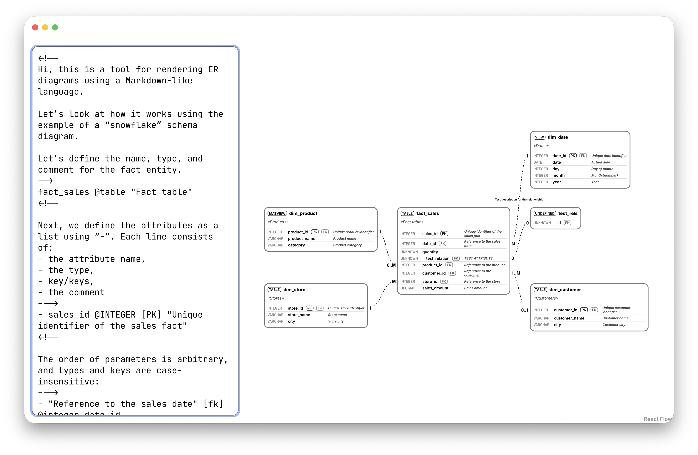

# ERMD

ERMD is a tool for rendering ER diagrams using a Markdown-like language.



## 🛠️ Installation

You can simply install it via docker with this one-liner:
```bash
docker build https://github.com/dsp-shp/ermd.git -t ermd && docker run -p 80:8080 -d ermd
```

And then open it at localhost page in your browser.

## 🚀 Usage

Let’s look at how to work with it using the example of a “snowflake” schema diagram.

Let’s define the name, type, and comment for the fact entity.
```
fact_sales @table "Fact table"
```

Next, we define the attributes as a list using “-”. Each line consists of:
- the attribute name,
- the type,
- key/keys,
- the comment
```
- sales_id @INTEGER [PK] "Unique identifier of the sales fact"
```

The order of parameters is arbitrary, and types and keys are case-insensitive:
```
- "Reference to the sales date" [fk] @integer date_id
```

And all parameters except the attribute name are optional:
```
- quantity
```

Right here we can specify a relationship
to another attribute of another entity.

Note: here a separate entity “test_rels” with the specified attribute “id” is rendered, even though later it is not explicitly defined anywhere. Such an entity gets the type “UNDEFINED” and the attribute type “UNKNOWN”, which indicates that it needs to be declared.

Also, both attributes automatically get a foreign key.
```
- __test_relation "TEST ATTRIBUTE" ---(0:0)---test_rels.id
- product_id @INTEGER "Reference to the product"
- customer_id @INTEGER "Reference to the customer"
- store_id @INTEGER "Reference to the store"
- sales_amount @DECIMAL "Sales amount"
```

Next, list all relationships separately from their entities in the format
schema1.table1---(Relationship type)---schema2.table2
```
* fact_sales.product_id---(0..M:1)---dim_product.product_id
* fact_sales.date_id---(M:1 "Test description for the relationship")---dim_date.date_id
* fact_sales.customer_id---1..M:0..1---dim_customer.customer_id
* fact_sales.store_id---M:1---dim_store.store_id
```

And define the dimensions:

```
@view dim_date "Dates"
- date_id @integer [pk] "Unique date identifier"
- date @date "Actual date"
- day @integer "Day of month"
- month @integer "Month (number)"
- year @integer "Year"

@matview dim_product "Products"
- product_id @integer [pk] "Unique product identifier"
- product_name @varchar "Product name"
- category @varchar "Product category"

dim_customer "Customers"
- customer_id @integer [pk] "Unique customer identifier"
- customer_name @varchar "Customer name"
- city @varchar "Customer city"

dim_store "Stores"
- store_id @integer [pk] "Unique store identifier"
- store_name @varchar "Store name"
- city @varchar "Store city"
```

Now you can delete all of this and try rendering your own diagram.
